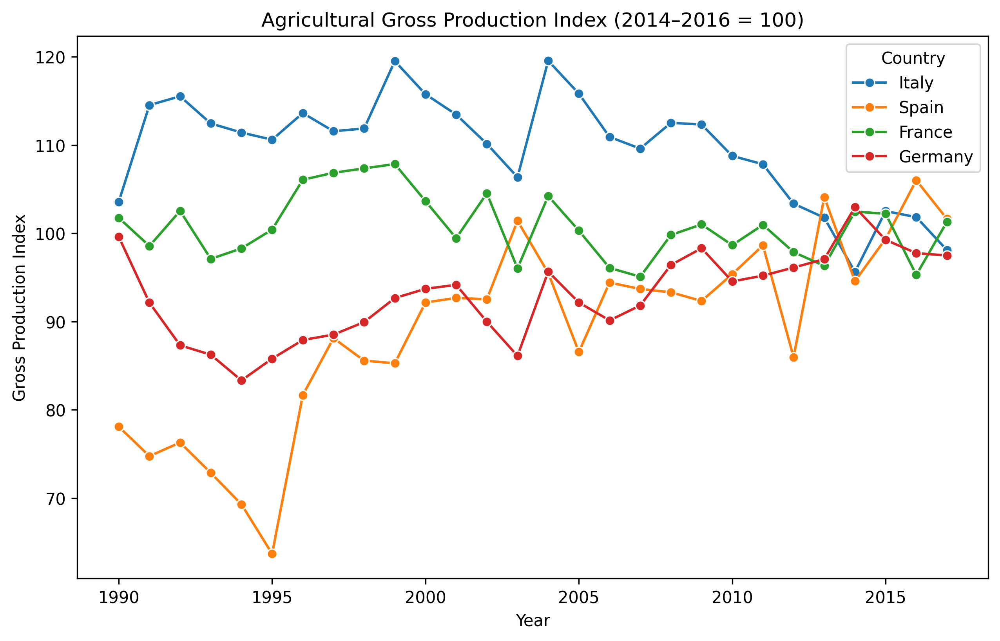
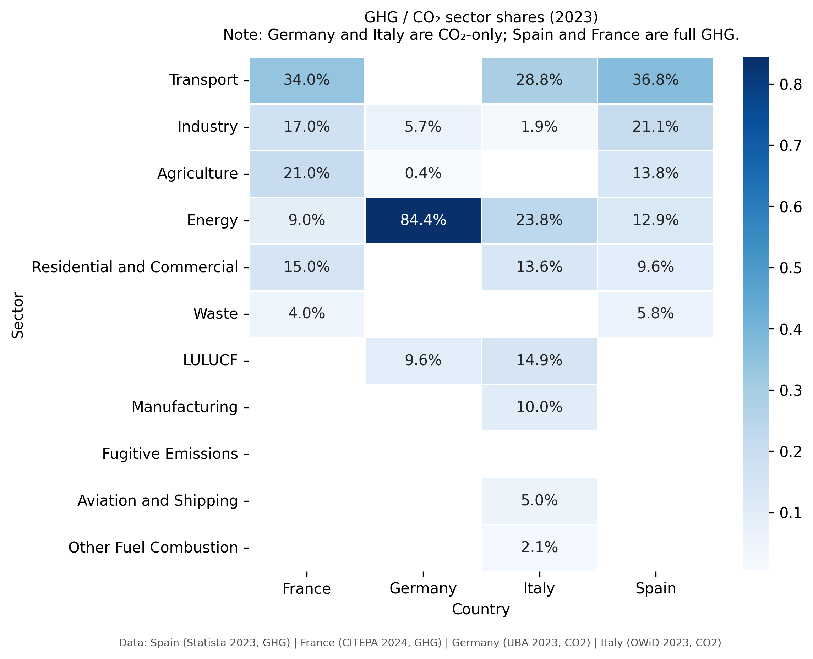
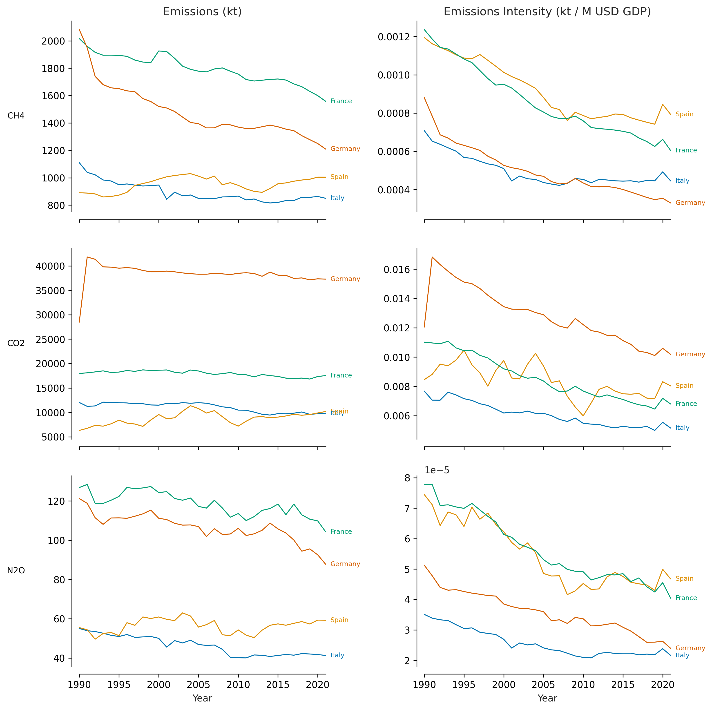
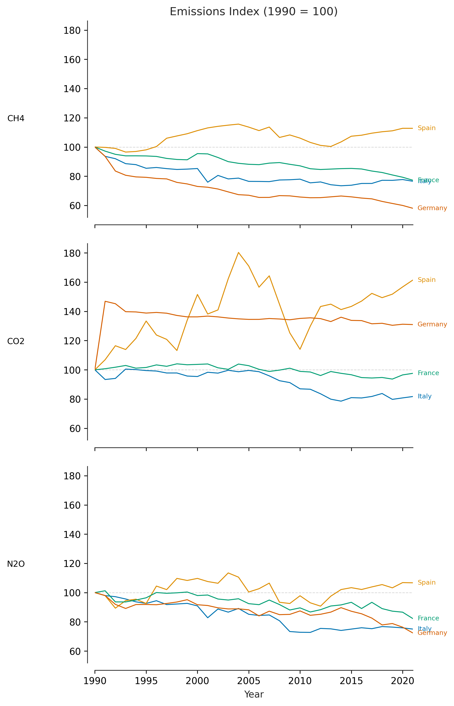
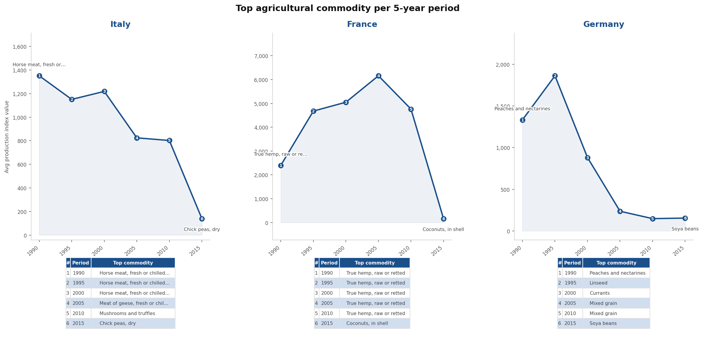

# European GHG Emissions & Agricultural Production Pipeline


A Python data engineering pipeline that ingests, validates, transforms, and stores greenhouse gas emissions and agricultural production data for Italy, Spain, France, and Germany (1990–2023). Outputs a DuckDB analytical database, five publication-quality figures, and an auto-generated Word report.

---

## Figures

| Agricultural Production Index | GHG Emissions by Sector |
|:--:|:--:|
|  |  |

| Emissions & Intensity | Emissions Index (1990 = 100) |
|:--:|:--:|
|  |  |

| Top Commodity by 5-Year Bin |
|:--:|
|  |

---

## Architecture

```
Data Sources                  Pipeline                     Outputs
────────────────              ──────────────────────────   ──────────────────
FAOSTAT CSVs      ──┐
World Bank API    ──┼──► loaders.py ──► clean_dat.py ──► DuckDB (pipeline.db)
UBA Sectors CSV   ──┤             ──► ag_data.py    ──► Figures/ (5 PNGs)
OWiD / Statista   ──┘             ──► sectors.py    ──► report.docx
CITEPA (hardcoded)
```

**Staging tables** hold cleaned raw data as ingested. **Mart tables** hold transformed, analysis-ready outputs. This mirrors the dbt staging/marts convention.

| Table | Type | Description |
|---|---|---|
| `stg_emissions` | Staging | FAOSTAT emissions by country / gas / year |
| `stg_ag_production` | Staging | Gross production index |
| `stg_fv_production` | Staging | Fruit & vegetable production index |
| `stg_ag_items` | Staging | Commodity-level production index |
| `stg_sector_shares` | Staging | Normalised sector proportions for all countries |
| `stg_gdp` | Staging | World Bank GDP (constant 2015 USD) |
| `mart_emissions_index` | Mart | Emissions with intensity and 1990=100 index |
| `mart_percent_change` | Mart | % change 1990 → latest year |
| `mart_index_slopes` | Mart | OLS annual slope per country / gas |
| `mart_top_ag_items` | Mart | Top commodity per country per 5-year bin |

---

## Tech Stack

| Concern | Tool |
|---|---|
| Data processing | pandas |
| Analytical database | DuckDB |
| Schema validation | Pandera |
| Visualisation | matplotlib / seaborn |
| Report generation | docx (Node.js) |
| Testing | pytest |
| CI | GitHub Actions |

---

## Project Structure

```
├── config.py                  # Single source of truth — countries, paths, constants
├── loaders.py                 # Reusable data ingestion (FAOSTAT, World Bank, M49)
├── clean_dat.py               # GHG emissions transforms and figures
├── ag_data.py                 # Agricultural production index analysis
├── sectors.py                 # Sector-level emissions breakdown and heatmap
├── db.py                      # DuckDB database layer
├── schemas.py                 # Pandera schema definitions
├── plot_utils.py              # Shared plotting utilities
├── run_all.py                 # Orchestration runner
├── build_report.js            # Automated Word report generator (Node.js / docx)
├── data_flow.jsx              # Interactive pipeline data flow diagram (React)
├── testing/
│   ├── test_pipeline.py       # Tests for loaders and transforms (44 tests)
│   ├── test_db.py             # Tests for database layer (24 tests)
│   └── test_schemas.py        # Tests for Pandera schemas (23 tests)
└── Figures/                   # Output figures (git-ignored)
```

---

## Getting Started

### Prerequisites

- Python 3.11+
- Node.js 18+ (for report generation only)

### Installation

```bash
git clone https://github.com/your-username/your-repo.git
cd your-repo
python -m venv .venv
source .venv/bin/activate       # Windows: .venv\Scripts\activate
pip install -r requirements.txt
```

### Data

Place the following source files in the project root:

| File | Source |
|---|---|
| `data.csv` | [FAOSTAT Emissions Totals](https://www.fao.org/faostat/en/#data/GT) |
| `FAOSTAT_data_western_europe.csv` | [FAOSTAT Production Indices](https://www.fao.org/faostat/en/#data/QI) |
| `FAOSTAT_southern_europe.csv` | FAOSTAT Production Indices |
| `FAOSTAT_data_fruit_veg.csv` | FAOSTAT Production Indices |
| `FAOSTAT_data_all_ag.csv` | FAOSTAT Production Indices |
| `UBA_sectors.csv` | [German Environment Agency](https://www.umweltbundesamt.de/en) |
| `italy_co-emissions-by-sector.csv` | [Our World in Data](https://ourworldindata.org/co2-emissions) |

Spain and France sector data are hardcoded in `sectors.py` from Statista (2023) and CITEPA (2024) respectively.

### Run

```bash
# Run the full pipeline (generates figures and populates pipeline.db)
python run_all.py

# Run individual steps
python run_all.py --only ag
python run_all.py --only emissions sectors

# Pre-fetch and cache network data (World Bank GDP, UNSD M49)
python run_all.py --cache-only

# Generate the Word report (requires Node.js)
npm install
node build_report.js
```

### Query the database

```python
from db import Database

with Database() as db:
    # Which country reduced CH4 the most?
    print(db.query("""
        SELECT Area, ROUND(percent_change, 1) AS pct_change
        FROM mart_percent_change
        WHERE Element = 'CH4'
        ORDER BY percent_change ASC
    """))

    # Emissions intensity trend for Italy
    print(db.query("""
        SELECT Year, ROUND(emissions_per_million_usd, 4) AS intensity
        FROM mart_emissions_index
        WHERE Area = 'Italy' AND Element = 'CO2'
        ORDER BY Year
    """))
```

---

## Testing

```bash
pytest                          # run all 91 tests
pytest testing/ -v              # verbose output
pytest testing/ -v -k "loaders" # run a specific class
pytest --tb=short               # shorter tracebacks
```

Tests use in-memory DuckDB databases and in-memory DataFrames — no source files required to run the test suite.

---

## Key Design Decisions

**Modular loaders with schema validation.** Each loader function is pure (path in, DataFrame out) and decorated with a Pandera `@check_output` schema. Bad data raises immediately at the ingestion boundary with a clear message showing exactly which rows and columns failed.

**`CountrySource` dataclass in `sectors.py`.** Each country's sector data is encapsulated in a `CountrySource` dataclass with a `load` callable and a `Gas` enum (`CO2` or `GHG`). The `to_long()` method normalises raw values to proportions and validates that they sum to ~1.0. Adding a new country requires one new entry in the `COUNTRY_SOURCES` registry.

**Staging / mart separation.** Staging tables hold data as it arrives from the source. Mart tables hold the output of transforms. Rerunning a transform step does not require re-ingesting raw data.

**Disk-cached network calls.** The World Bank GDP API and UNSD M49 lookup are fetched once and cached to CSV. Subsequent pipeline runs are fully offline. Cache files are git-ignored.

**Extensible country registry.** Adding a fifth country requires one edit to `COUNTRIES` in `config.py`, one new `CountrySource` entry in `sectors.py`, and the relevant source CSVs. No other files need to change.

---

## Data Notes

- FAOSTAT emissions series covers 1990–2021. Agricultural production index covers 1990–2017.
- Spain is absent from the gross production index series (`stg_ag_production`) due to unavailability in the FAOSTAT regional files used. It does appear in the commodity-level dataset (`stg_ag_items`).
- Sector-level breakdown uses heterogeneous sources aligned to 2023: Germany (UBA) and Italy (Our World in Data) report CO₂ only; France (CITEPA) and Spain (Statista) report full GHG baskets. Cross-country sector comparisons should be interpreted with this in mind — agriculture's share appears artificially small for Germany because agricultural CH₄ and N₂O are excluded from the CO₂-only UBA series.

---

## Potential Extensions

- [ ] Add a FastAPI layer to serve mart tables as REST endpoints
- [ ] Replace manual CSV exports with direct FAOSTAT API ingestion
- [ ] Expand to additional EU countries using the existing extensible architecture
- [ ] Add dbt models for the transform layer
- [ ] Schedule pipeline runs with Airflow or GitHub Actions on a cron trigger
- [ ] Replace heterogeneous sector sources with a harmonised dataset (e.g. UNFCCC National Inventory Submissions or EEA reporting)